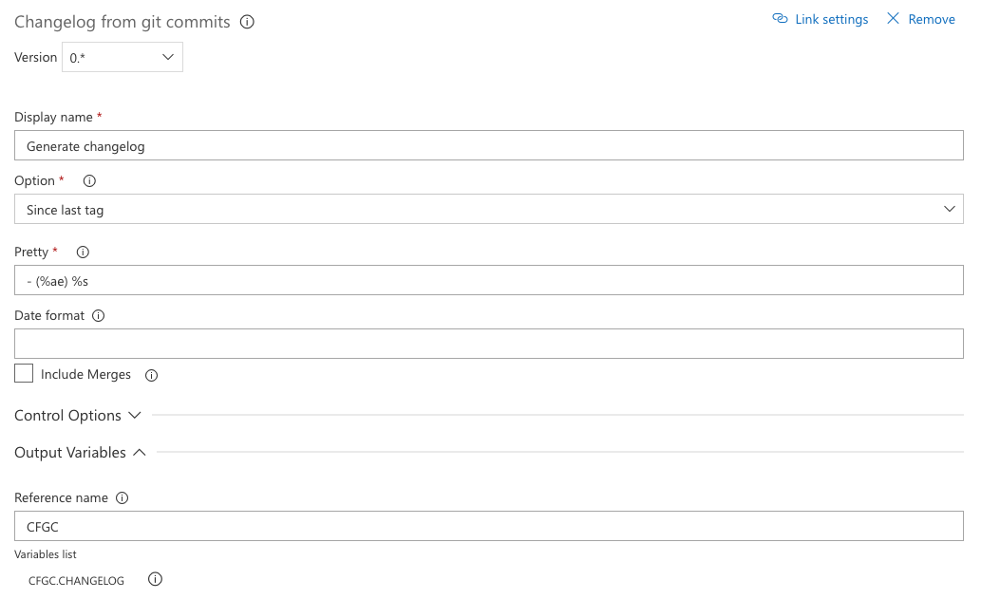

# CFGC - Changelog from git commits

## Overview

This VSTS/TFS marketplace task generates changelog from commit messages. This task was built inspired by [changelog_from_git_commits](https://docs.fastlane.tools/actions/changelog_from_git_commits/) action of [Fastlane](https://fastlane.tools/) tools.

## Author

Tigran Hambardzumyan, tigran@stdevmail.com

## Support

Feel free to [open issuses](https://github.com/stdevteam/cfgc/issues/new) with any suggestions, bug reports, feature requests, questions.

## Let us know!

We’d be really happy if you sent us links to your projects where you use our component. Just send an email to developer@stdevmail.com and do let us know if you have any questions or suggestion.

## License

RxRestClient is available under the MIT license. See the [LICENSE](./LICENSE) file for more info.