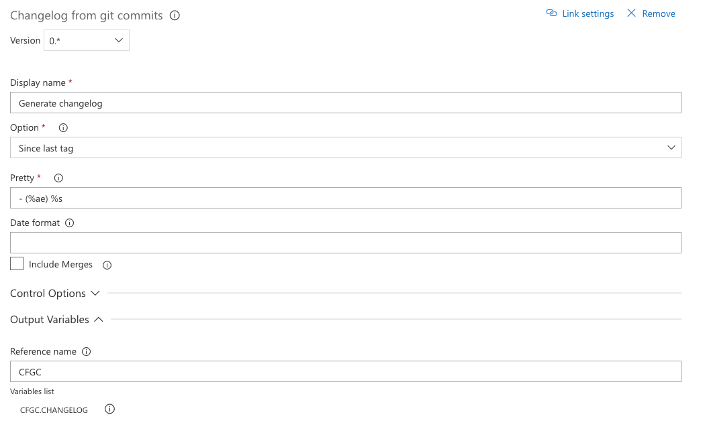

# CFGC - Changelog from git commits

## Overview

This VSTS/TFS marketplace task generates changelog from commit messages. This task was built inspired by [changelog_from_git_commits](https://docs.fastlane.tools/actions/changelog_from_git_commits/) action of [Fastlane](https://fastlane.tools/) tools.

## How to use

1. Install the extension from marketplace (from [here](https://marketplace.visualstudio.com/items?itemName=STDevTeam.stdev-cfgc-extension)) ([how to install task from marketplace?](https://docs.microsoft.com/en-us/azure/devops/marketplace/install-extension?view=azure-devops&tabs=browser))

2. Create new pipeline with classic editor

3. Click to Add button to add task

4. Search in the list of task to find **Changelog from git commits** and click Add button

5. Add you configurations

6. **Important:** use output variable to get the result changeling to env variable

7. Use `$(cfgs. CHANGELOG)` variable to use your changelog.

## Author

Tigran Hambardzumyan, tigran@stdevmail.com

## Support

Feel free to [open issuses](https://github.com/stdevteam/cfgc/issues/new) with any suggestions, bug reports, feature requests, questions.

## Let us know!

We’d be really happy if you sent us links to your projects where you use our component. Just send an email to developer@stdevmail.com and do let us know if you have any questions or suggestion.

## License

RxRestClient is available under the MIT license. See the [LICENSE](./LICENSE) file for more info.
